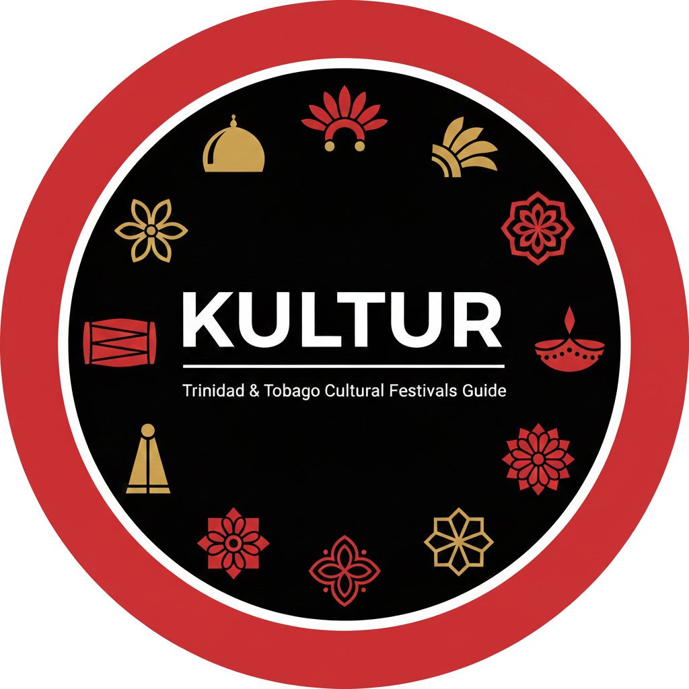

<p align="center">
  
</p>

<h1 align="center">KULTUR</h1>

<p align="center">
  <strong>A first-timer's guide to Trinidad & Tobago's cultural festivals.</strong>
</p>

<p align="center">
  <a href="https://kultur-tt.app">Live Site</a> •
  <a href="#the-problem">The Problem</a> •
  <a href="#features">Features</a> •
  <a href="#documentation">Documentation</a>
</p>

---

## Table of Contents

- [The Problem](#the-problem)
- [The Gap in the Market](#the-gap-in-the-market)
- [Our Solution](#our-solution)
- [Features](#features)
- [Use Cases](#use-cases)
- [Why This Matters](#why-this-matters)
- [The Opportunity](#the-opportunity)
- [Demo Highlights](#demo-highlights)
- [Technical Overview](#technical-overview)
- [Documentation](#documentation)
- [Quick Start](#quick-start)
- [The Team](#the-team)

---

## The Problem

> *"On October 30, 1884, British authorities opened fire on a peaceful Hosay procession in San Fernando. 22 people died, 120+ were wounded. It's one of the bloodiest events in Trinidad's colonial history.*
>
> *Most Trinis have never heard of it."*

Trinidad & Tobago is home to **over 20 cultural festivals** spanning African, Indian, Indigenous, European, and Chinese heritage. These festivals represent centuries of tradition, survival, and cultural fusion that make T&T unique in the Caribbean.

**But most people only know Carnival.**

The information about these festivals is:
- **Scattered** across Facebook groups, outdated government sites, and academic archives
- **Inaccessible** to first-timers who don't know the etiquette, dress codes, or what to expect
- **Invisible** to the diaspora trying to reconnect with their heritage
- **Missing** from tourist experiences seeking authenticity beyond the beach

---

## The Gap in the Market

| What Exists | The Problem |
|:------------|:------------|
| WahWeDoing.com | 300+ Carnival parties, zero indigenous festivals |
| VisitTrinidad.tt | Last updated 2020 |
| DiscoverTnT.com | Calendar frozen on 2020 |
| NALIS archives | Excellent content, buried in academic format |
| Facebook groups | Fragmented, unsearchable, no context for newcomers |

**No platform exists that helps someone attend a festival they've never been to.**

People don't just need to know *when* a festival happens. They need to know *what it is*, *what to expect*, and *how to participate respectfully*.

---

## Our Solution

A platform that serves as a **first-timer's guide** to every major cultural festival in Trinidad & Tobago.

KULTUR bridges the gap between cultural knowledge holders and those seeking to learn. We provide the context, etiquette, and practical information that turns curious observers into respectful participants.

---

## Features

### Festival Calendar
- Browse all festivals by month, region, or heritage type
- Interactive calendar with color-coded heritage types
- "This Week in T&T" section for upcoming festivals

### First-Timer's Guides
Each festival includes:
- **The Story** — History and cultural significance
- **What to Expect** — Sights, sounds, and atmosphere
- **How to Participate** — Dress code, etiquette, what's appropriate
- **Practical Info** — Parking, food, best viewing spots

### Newsletter & Reminders
- Email subscription for festival updates
- Festival reminder notifications
- Weekly digest of upcoming festivals

### Community Memories
- Real stories from people who've attended
- Submit your own festival memories
- No account required — low friction

---

## Use Cases

### The Local Who's Never Been
*"I've lived in Trinidad my whole life but never attended Hosay. I didn't know what to wear or if I was even allowed to go."*

KULTUR provides the confidence to attend for the first time, with clear guidance on etiquette and expectations.

### The Diaspora Returning Home
*"I grew up in New York but my grandparents always talked about Divali Nagar. I'm visiting in November and want to experience it properly."*

KULTUR helps diaspora plan meaningful visits around cultural events, reconnecting with traditions their families left behind.

### The Tourist Seeking Authenticity
*"I've done the beaches. I want to experience the real Trinidad, not just the tourist version."*

KULTUR opens doors to authentic cultural experiences beyond the typical tourist trail.

### The Parent Teaching Their Children
*"My kids are growing up in Canada. I want them to understand where they come from."*

KULTUR documents traditions in an accessible way, helping parents share cultural heritage with the next generation.

### The Researcher or Journalist
*"I'm writing about Caribbean religious syncretism and need accurate information about Spiritual Baptist practices."*

KULTUR provides well-researched, respectful documentation of cultural practices.

---

## Why This Matters

### Cultural Preservation

Trinidad & Tobago's cultural landscape is extraordinary:

- **First Peoples Heritage** — The Santa Rosa First Peoples Community in Arima is the last organized Indigenous group in T&T, preserving traditions from 8,000+ years of continuous Amerindian presence
- **Hosay** — A solemn Islamic observance brought by Indian indentured laborers in 1845, with tadjahs reaching 30 feet tall
- **Divali Nagar** — The largest Divali celebration in the English-speaking Caribbean
- **Spiritual Baptist Liberation Day** — Commemorating the 1951 repeal of the Shouter Prohibition Ordinance that had banned the faith for 34 years

These traditions risk fading from public consciousness when they're not documented and shared accessibly.

### Diaspora Connection

**374,500 Trinbagonians** live abroad in the USA, Canada, and UK. Many are disconnected from the cultural traditions of their homeland. This platform gives them a way to:
- Learn about festivals their parents and grandparents attended
- Plan meaningful visits home around cultural events
- Share these traditions with the next generation

### Tourism with Authenticity

**158,890 tourists** arrived in T&T between January and May 2025 (up 13.7% year-over-year). The Ministry of Tourism is actively pushing "community-centered experiences" — exactly what KULTUR enables.

Instead of just beaches and Carnival, tourists can experience:
- Hosay processions in St. James
- Santa Rosa Festival in Arima
- Ramleela performances across 35+ sites
- Phagwa celebrations island-wide

---

## The Opportunity

| Metric | Value |
|:-------|:------|
| Cultural festivals in T&T | 20+ |
| Trinbagonians in diaspora | 374,500 |
| Tourist arrivals (Jan-May 2025) | 158,890 |
| Tourism growth YoY | +13.7% |
| Existing platforms serving this need | 0 |

---

## Demo Highlights

Our demo showcases **10 festivals** across multiple heritage types:

| Festival | Heritage | Significance |
|:---------|:---------|:-------------|
| Hosay | Indian/Islamic | Solemn observance with 1884 massacre history |
| Santa Rosa Festival | Indigenous | Last organized First Peoples community |
| First Peoples Heritage Week | Indigenous | October celebration of Amerindian heritage |
| Divali | Indian/Hindu | Largest in English-speaking Caribbean |
| Emancipation Day | African | August 1 commemoration |
| Spiritual Baptist Liberation Day | African | March 30, end of religious persecution |
| Phagwa | Indian/Hindu | Spring festival of colors |
| Ramleela | Indian/Hindu | Open-air theatre at 35+ sites |
| Parang | Mixed | Christmas music tradition |
| Carnival | Mixed | The one everyone knows |

---

## Technical Overview


| Layer | Technology | Hosting |
|:------|:-----------|:--------|
| Frontend | SvelteKit 2, Svelte 5, TailwindCSS 4 | Vercel |
| Backend | Go 1.24, Echo | Cloud Run |
| Database | PostgreSQL | Neon |
| Email | Resend | Custom domain |
| CI/CD | GitHub Actions | Automated testing & deployment |

For technical deep-dive, see [docs/IMPLEMENTATION.md](docs/IMPLEMENTATION.md).

---

## Documentation

| Document | Description |
|:---------|:------------|
| [frontend/README.md](frontend/README.md) | Frontend setup and development |
| [backend/README.md](backend/README.md) | Backend setup and API reference |
| [docs/SETUP.md](docs/SETUP.md) | Complete local development guide |
| [docs/ROUTES.md](docs/ROUTES.md) | API routes reference |
| [docs/IMPLEMENTATION.md](docs/IMPLEMENTATION.md) | Technical architecture and decisions |
| [docs/DEMO.md](docs/DEMO.md) | Email template testing guide |
| [docs/PLANNING.md](docs/PLANNING.md) | Original hackathon planning document |
| [docs/CLOUD_RUN_MIGRATION.md](docs/CLOUD_RUN_MIGRATION.md) | Fly.io to Cloud Run migration guide |

---

## Quick Start

```bash
# Clone
git clone https://github.com/aidantrabs/kultur.git
cd kultur

# Backend
cd backend
cp .env.example .env  # Get values from codeowner
go run ./cmd/server

# Frontend (new terminal)
cd frontend
npm install
npm run dev
```

See [docs/SETUP.md](docs/SETUP.md) for comprehensive instructions.

---

## The Team

| Name | Role |
|:-----|:-----|
| **Aidan** | Backend Development |
| **Tevin** | Frontend Development |
| **Jahzara** | Content & Cultural Research |

---

<p align="center">
  <strong>KULTUR</strong> · Your guide to Trinidad's cultural festivals
</p>

<p align="center">
  <em>TrinbagoTech Hackathon 2026 · January 30 – February 2</em>
</p>
